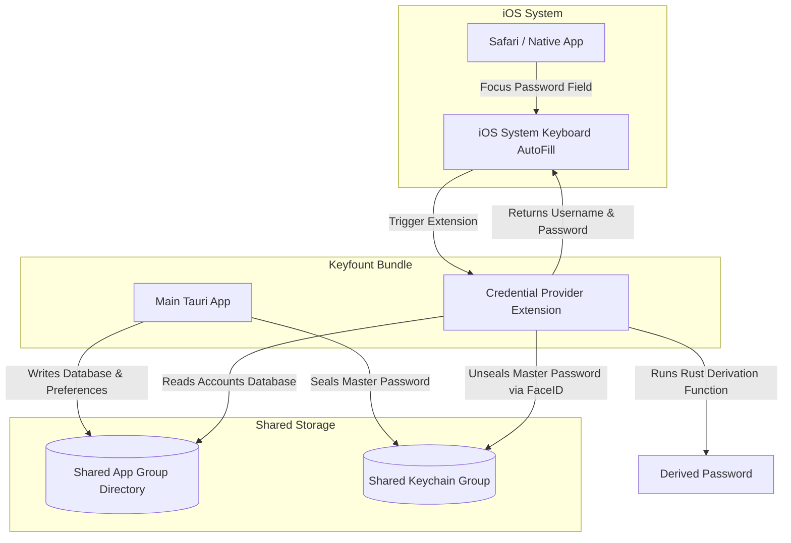

# iOS AutoFill Credential Provider Extension Integration

Integrating Keyfount with the native iOS password autofill system allows users to fill usernames and derived passwords directly in Safari and other native iOS applications.

This document outlines the architectural requirements, data-sharing strategies, Rust-Swift bindings, and Xcode configurations needed to implement this native integration.

---

## 1. High-Level Architecture

iOS Autofill uses the **AuthenticationServices** framework. To participate as an autofill source, Keyfount must bundle an **AutoFill Credential Provider Extension** alongside the main application.



---

## 2. Shared Data Strategy (App Groups & Keychain)

An App Extension runs in a separate process with its own sandbox. To read Keyfount's accounts and securely retrieve the vault's master password, the main app and extension must share access.

### A. App Groups (Database & Settings Sharing)
To share the list of domains, usernames, and site profiles, the database must reside in a shared folder:
1. Enable the **App Groups** capability in Xcode for both targets.
2. Use a shared identifier, e.g., `group.io.keyfount.app`.
3. In Rust/Tauri, instead of resolving the local app data directory, resolve the shared app group container path:
   ```swift
   // Swift side to resolve the URL:
   let sharedContainerURL = FileManager.default.containerURL(forSecurityApplicationGroupIdentifier: "group.io.keyfount.app")
   ```
4. Configure Keyfount's SQLite database connection path to use this shared container path.

### B. Keychain Sharing (Secure Master Password sharing)
Since Keyfount is a *deterministic* manager, it does not store passwords; it derives them on the fly from the **Master Password**. 
1. Enable the **Keychain Sharing** capability in Xcode for both targets.
2. Use a shared keychain group (e.g., `io.keyfount.shared`).
3. When the user enables biometrics in Settings, the master password is encrypted and saved under this shared keychain service group.
4. When the iOS Autofill extension is triggered:
   - It attempts to read the biometric-sealed master password from the shared keychain.
   - It prompts Face ID/Touch ID natively.
   - On success, it retrieves the master password in memory to perform the derivation.

---

## 3. Rust-Swift Bridge (Password Derivation)

To derive the password matching the site's profile, the Swift extension must run the exact same cryptographic function as the Rust core: `crypto::derive_password(...)`.

Rather than rewriting PBKDF2/Argon2/AES-GCM in Swift, compile the Rust core as a static library (`.a`) or XCFramework and expose the derivation function via a C header or **UniFFI**:

### Exposed Rust Bridge Function
```rust
// Exposed C-ABI function or UniFFI module
#[no_mangle]
pub unsafe extern "C" fn derive_keyfount_password(
    master: *const c_char,
    domain: *const c_char,
    email: *const c_char,
    profile_json: *const c_char,
) -> *mut c_char {
    // 1. Convert pointers to Rust strings
    // 2. Deserialise Profile JSON
    // 3. Run crypto::derive_password
    // 4. Return allocated C-string
}
```

---

## 4. Swift Credential Provider Extension Implementation

In the extension project, create a subclass of `ASCredentialProviderViewController`.

### Extension Code Blueprint

```swift
import UIKit
import AuthenticationServices
import LocalAuthentication

class CredentialProviderViewController: ASCredentialProviderViewController {
    
    @IBOutlet weak var tableView: UITableView!
    
    // Loaded from the shared SQLite database in the App Group
    var matchingAccounts: [Account] = []
    var domainRequested: String = ""

    override func prepareInterface(for serviceIdentifiers: [ASCredentialServiceIdentifier]) {
        // 1. Extract the requested domain from service identifiers
        for serviceIdentifier in serviceIdentifiers {
            if serviceIdentifier.type == .domain {
                self.domainRequested = serviceIdentifier.identifier
                break
            }
        }
        
        // 2. Query the shared database for accounts matching self.domainRequested
        self.matchingAccounts = loadAccountsFromSharedDatabase(for: self.domainRequested)
        
        // 3. Reload tableView UI
        self.tableView.reloadData()
    }
    
    func selectAccountAndAutofill(_ account: Account) {
        // 1. Trigger Face ID/Touch ID to retrieve master password from shared Keychain
        unsealMasterPassword(vaultId: account.vaultId) { result in
            switch result {
            case .success(let masterPassword):
                // 2. Call Rust core to derive the password on the fly
                let derivedPassword = deriveKeyfountPassword(
                    master: masterPassword,
                    domain: account.domain,
                    email: account.username,
                    profileJson: account.profileJson
                )
                
                // 3. Hand credentials back to iOS
                let credential = ASPasswordCredential(user: account.username, password: derivedPassword)
                self.extensionContext.completeRequest(withSelectedCredential: credential, completionHandler: nil)
                
            case .failure(let error):
                self.showError("Authentication failed: \(error.localizedDescription)")
            }
        }
    }
    
    // Core biometric-unseal wrapper
    private func unsealMasterPassword(vaultId: String, completion: @escaping (Result<String, Error>) -> Void) {
        let context = LAContext()
        context.localizedReason = "Unlock Keyfount to autofill credentials"
        
        context.evaluatePolicy(.deviceOwnerAuthenticationWithBiometrics, localizedReason: context.localizedReason) { success, error in
            guard success else {
                completion(.failure(error ?? NSError(domain: "LAError", code: -1)))
                return
            }
            
            // Read password from keychain
            do {
                let master = try KeychainHelper.readSharedPassword(account: "keyfount.vault.\(vaultId).biometric")
                completion(.success(master))
            } catch {
                completion(.failure(error))
            }
        }
    }
}
```

---

## 5. Xcode & Tauri Project Configuration

To add the target permanently to the Tauri mobile configuration:

1. **Modify Xcode Project Template**:
   Tauri generates the Xcode wrapper in `src-tauri/gen/apple/`. Add a `AutofillExtension` target of type **Credential Provider Extension** inside the project.
2. **Entitlements**:
   - Create `Keyfount.entitlements` and `AutofillExtension.entitlements`.
   - Add App Groups key: `group.io.keyfount.app`.
   - Add Keychain Groups key: `io.keyfount.shared`.
3. **Provisioning Profiles**:
   - Ensure the extension Bundle ID matches the format `<Main-App-Bundle-ID>.<Extension-Name>` (e.g., `io.keyfount.desktop.autofill`).
   - Both app IDs must be registered in the Apple Developer Portal and share provisioning profiles with App Groups activated.
